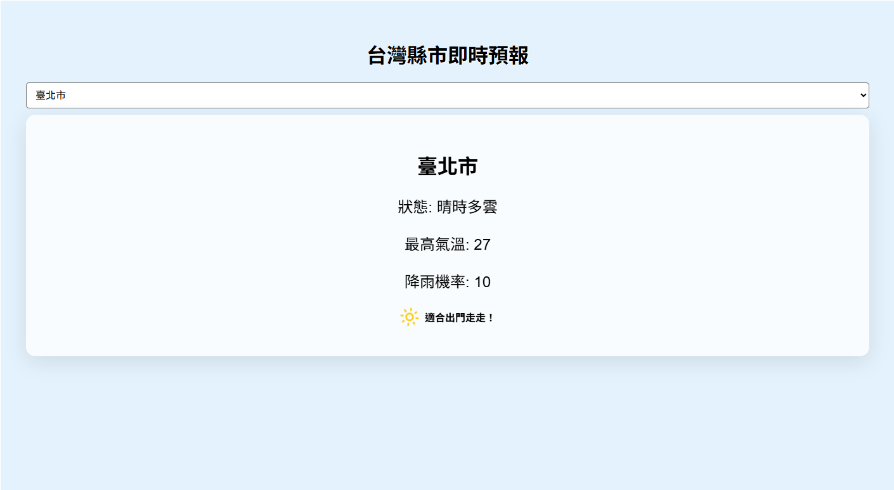

# 🌦️ 台灣極簡氣象查詢 (Minimalist Taiwan Weather App)

這是一個基於 **React** 開發的極簡風天氣查詢網頁。透過串接 **中央氣象署 (CWA)** 的開放 API，提供台灣各縣市的即時預報資料，並根據降雨機率動態改變網頁視覺風格。
---
[web-demo](https://jen041794.github.io/new_weather_app/)
---
## 🚀 核心功能

- **即時資料同步**：串接中央氣象署 `F-C0032-001` API，獲取 24 小時內天氣預報。
- **縣市下拉切換**：支援全台灣 22 個縣市選擇，並預設顯示「臺北市」。
- **情境化視覺設計**：
  - **動態背景**：背景顏色隨降雨機率改變（晴天暖黃、雨天清藍）。
  - **智慧提示**：自動判斷降雨機率，給予「記得帶傘」或「適合出門」的貼心建議。
  - **響應式佈局**：支援手機與桌面端瀏覽。

## 🛠️ 使用技術

- **前端框架**：React 18
- **工具鏈**：Create React App (CRA) / Webpack
- **圖示庫**：Lucide React
- **資料處理**：JavaScript Fetch API & 非同步處理 (Async/Await)
- **樣式設計**：CSS3 (包含 Flexbox, Glassmorphism 毛玻璃效果, Transitions 動態過渡)

## 📸 畫面預覽

